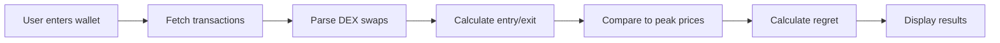

# 💸 Paperhands.cc - Solana Paperhands Tracker

**Live Demo**: [paperhands.cc](https://paperhands.cc)  
**Twitter**: [@bnbpaperhands](https://twitter.com/bnbpaperhands)

Track the biggest regrets in Solana trading. See who sold too early and missed generational wealth.

---

## 🚀 Quick Start

```bash
# Install dependencies
npm install

# Run development server
npm run dev

# Build for production
npm run build
```

---

## 🛠️ Tech Stack

- **Frontend**: React 18 + TypeScript + Vite
- **Styling**: TailwindCSS + Custom Design System
- **UI Components**: shadcn/ui + Radix UI
- **Animations**: Framer Motion
- **Charts**: Recharts
- **Routing**: React Router v6
- **State Management**: TanStack Query

---

## 🔌 Making It Work with Real Data

Currently, the app uses **mock data** for demonstration. Here's how to connect real Solana blockchain data:

### **Step 1: Get API Keys**

You'll need:
1. **Helius RPC** (recommended) or **QuickNode**
   - Sign up at [helius.dev](https://helius.dev) or [quicknode.com](https://www.quicknode.com)
   - Get your RPC endpoint URL

2. **Optional: Birdeye API** for price data
   - Sign up at [birdeye.so](https://birdeye.so)
   - Get your API key

### **Step 2: Set Environment Variables**

Create a `.env` file in the root:

```env
VITE_SOLANA_RPC_URL=https://mainnet.helius-rpc.com/?api-key=YOUR_KEY
VITE_BIRDEYE_API_KEY=your_birdeye_key_here
```

### **Step 3: Install Solana Dependencies**

```bash
npm install @solana/web3.js @solana/spl-token @project-serum/anchor
```

### **Step 4: Update the Integration**

The app is pre-wired for real data integration. Key files:

- **`src/services/solana.ts`** - Fetches wallet transactions from Solana RPC
- **`src/services/paperhands.ts`** - Analyzes trades and calculates paperhands metrics
- **`src/pages/Dashboard.tsx`** - Uncomment the real API calls (lines marked with `// REAL API`)

#### Enable Real Data in Dashboard:

```typescript
// In src/pages/Dashboard.tsx, replace this:
const mockStats = generateMockWalletStats(walletInput);
setWalletStats(mockStats);

// With this:
const realStats = await analyzePaperhands(walletInput);
setWalletStats(realStats);
```

### **Step 5: Understanding the Data Flow**



**What the analyzer does:**
1. Fetches all transactions for the wallet using Solana RPC
2. Identifies DEX swaps (Jupiter, Raydium, Orca, etc.)
3. Matches buys and sells for each token
4. Fetches historical price data to find peak prices
5. Calculates "paperhands regret" = (Peak Price - Sell Price) × Amount
6. Generates paperhands score based on total regret vs total profit

---

## 📊 Features

### ✅ Current Features
- **Wallet Analysis**: Enter any Solana address to analyze
- **Dashboard**: Comprehensive metrics with charts
- **Leaderboard**: Global ranking of biggest paperhands
- **Profile Modal**: Detailed wallet breakdown with tabs
- **How It Works**: Transparent explanation of calculations
- **API Docs**: Mock API documentation for future backend
- **Responsive Design**: Works on all devices
- **Dark Mode**: Eye-friendly interface
- **Animations**: Smooth transitions and micro-interactions

### 🚧 Coming Soon
- **Rewards Program**: Earn tokens for sharing paperhands moments
- **Real-time Updates**: Live tracking of new paperhands events
- **Compare Wallets**: Side-by-side comparison tool
- **Export Reports**: PDF/CSV export functionality
- **Social Features**: Share your worst trades on Twitter

---

## 🎨 Design System

The app uses a custom green "money" theme derived from the logo:

- **Primary**: Vibrant money green (`#22C55E`)
- **Accent**: Deep forest green
- **Background**: Rich black with subtle gradients
- **Typography**: Inter font family
- **Effects**: Glass morphism, depth shadows, smooth animations

All colors are defined as CSS custom properties in `src/index.css` and can be easily customized.

---

## 📁 Project Structure

```
src/
├── components/          # Reusable UI components
│   ├── ui/             # shadcn/ui components
│   ├── AnimatedLoader.tsx
│   ├── CursorTrail.tsx
│   ├── MetricCard.tsx
│   ├── Navigation.tsx
│   ├── ProfileModal.tsx
│   └── SplashScreen.tsx
├── pages/              # Route pages
│   ├── Landing.tsx
│   ├── Dashboard.tsx
│   ├── Leaderboard.tsx
│   ├── Rewards.tsx
│   ├── HowItWorks.tsx
│   ├── ApiDocs.tsx
│   └── About.tsx
├── services/           # Business logic & API calls
│   ├── solana.ts       # Solana blockchain integration
│   └── paperhands.ts   # Paperhands analysis engine
├── lib/
│   ├── mockData.ts     # Demo data
│   └── utils.ts        # Helper functions
├── types/
│   └── paperhands.ts   # TypeScript interfaces
└── hooks/              # Custom React hooks
```

---

## 🔧 Configuration

### Tailwind Config
Customize theme in `tailwind.config.ts`:
- Colors
- Fonts
- Breakpoints
- Animations

### Design Tokens
Edit `src/index.css` for:
- CSS variables
- Global styles
- Custom animations

---

## 🐛 Troubleshooting

**Problem**: "Failed to fetch wallet data"
- Check your RPC endpoint is correct in `.env`
- Verify the wallet address is valid Solana address
- Check Helius/QuickNode dashboard for rate limits

**Problem**: "Price data unavailable"
- Birdeye API key may be missing or invalid
- Token might be too new/illiquid for price history
- Fallback to mock data is automatic

**Problem**: Charts not rendering
- Ensure `recharts` and `react-is` are installed
- Clear browser cache
- Check console for errors

---

## 🚀 Deployment

### Option 1: Lovable Platform (Easiest)
1. Open your project in [Lovable](https://lovable.dev)
2. Click Share → Publish
3. Your site is live!

### Option 2: Vercel
```bash
# Install Vercel CLI
npm i -g vercel

# Deploy
vercel
```

### Option 3: Netlify
```bash
# Build
npm run build

# Deploy dist/ folder to Netlify
```

---

## 📈 Roadmap

**Phase 1** (Current): Mock data demo with full UI  
**Phase 2**: Real Solana integration  
**Phase 3**: User accounts & saved wallets  
**Phase 4**: Rewards program launch  
**Phase 5**: Mobile app (React Native)

---

## 🤝 Contributing

Contributions welcome! Please:
1. Fork the repository
2. Create a feature branch
3. Make your changes
4. Submit a pull request

---

## 📄 License

MIT License - feel free to use this for your own projects!

---

## 🙏 Credits

- **Design**: Custom green money theme
- **Icons**: Lucide React
- **Components**: shadcn/ui
- **Charts**: Recharts
- **Animations**: Framer Motion

---

## 📞 Contact

Questions? Reach out:
- **Twitter**: [@bnbpaperhands](https://twitter.com/bnbpaperhands)
- **Email**: hello@paperhands.cc

---

**Built with ❤️ for the Solana community**
